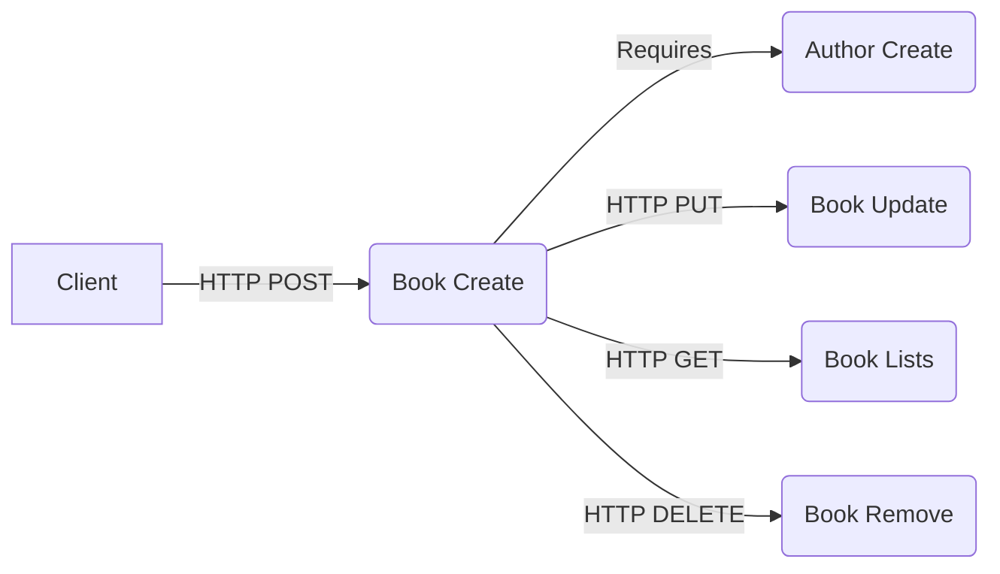
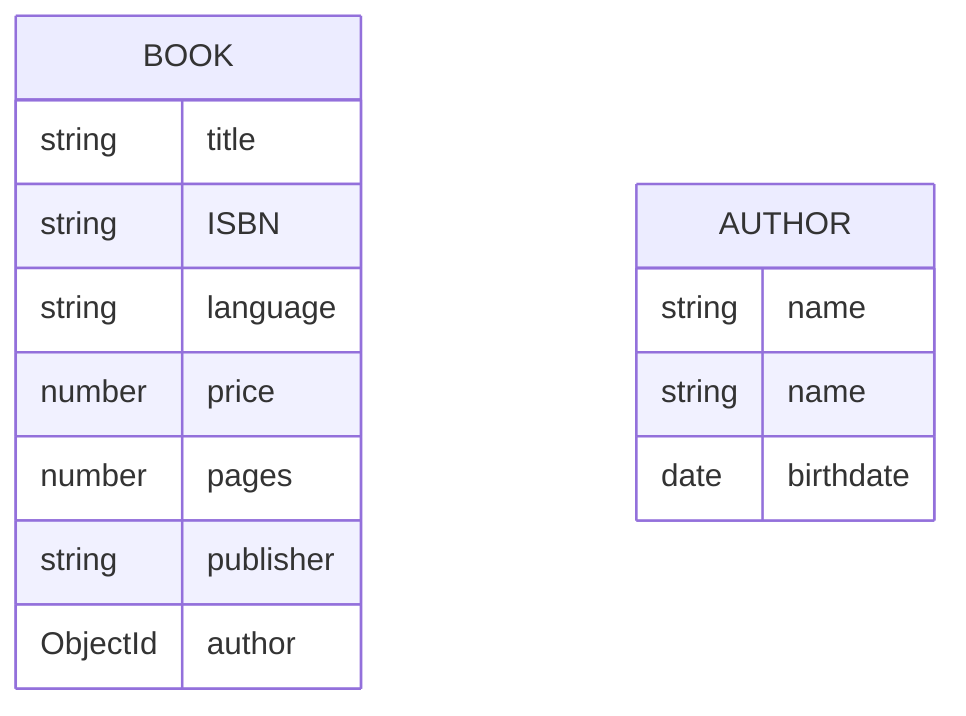
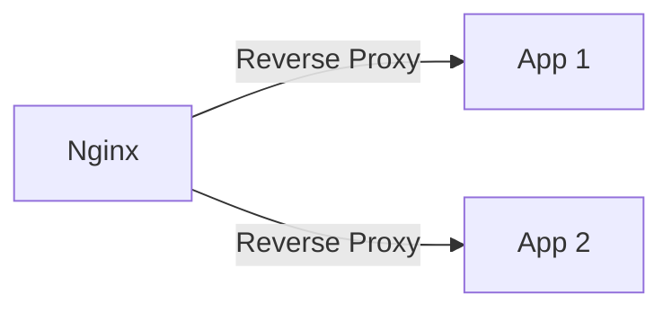

<!-- PROJECT LOGO -->
<br />
<div align="center">
  <a href="https://github.com/othneildrew/Best-README-Template">
    
  </a>

  <h3 align="center">Book App</h3>

  <p align="center">
    An awesome Online Book to jumpstart your books!
    <br />
    <a href="https://gitlab.com/nurie487/book-app/-/blob/main/README.md"><strong>Explore the docs »</strong></a>
    <br />
    <br />
    <a href="https://gitlab.com/nurie487/book-app">View Demo</a>
    <a href="https://gitlab.com/nurie487/book-app/-/issues">Request Feature</a>
  </p>
</div>


 
<!-- ABOUT THE PROJECT -->
## About The Project With  Workflow

- This project has been created by hubx for the purpose of task. The aim of the project is to perform CRUD operations such as book creation, author creation, book deletion, book update, and book listing. 

- The concept of Restful API has been reinforced. In the project, author creation needs to be done beforehand because when creating a book, author information is added based on the ID. Additionally, for operations like book deletion and book update, queries are made based on the ID."
 
 



- ### Endpoints

    - Endpoint: `/api/author` 
        -  (Create): This endpoint is used to create a new author.
    - Endpoint: `/api/book`
        -   (Create): This endpoint is used to create a new book.
    - Endpoint: `/api/books`
        -  (List): This endpoint is used to list all books.
    - Endpoint: `/api/book/:id`
        -  (Update): This endpoint is used to update a book.
      
    - Endpoint: `/api/book/:id`
        -  (Delete): This endpoint is used to delete a book.


- ### Error Handling 

  - `In the project, error handling was done over the Middleware concept with the library I wrote.` 
   
    `1: Request Validation Error`: When the condition in the request body is not met, the RequestValidationError class is used to generate an error. This error is then passed through the errorHandler middleware, where it is serialized and sent as a response to the client.

    `2: NotFoundError and Similar Errors`: In this case, after the custom Error object is handled by the errorHandler middleware, it is serialized and returned to the client as a response in an appropriate format.
  - `If you have any question, please do not hesitate to ask.`
 
- ### Database Schema

  - `In the project, MongoDB was used as the database. The database schema is as follows:`



- ### Unit Test Coverage

  - `In the project, unit tests were written with the Jest library.`

  File                | % Stmts | % Branch | % Funcs | % Lines | Uncovered Line #s
  --------------------|---------|----------|---------|---------|-------------------
  All files           |   98.09 |      100 |     100 |   98.07 |
  src                |     100 |      100 |     100 |     100 |
    app.ts            |     100 |      100 |     100 |     100 |
  src/controllers    |   95.74 |      100 |     100 |   95.74 |
    author.ts         |      90 |      100 |     100 |      90 | 21
    book.ts           |   97.29 |      100 |     100 |   97.29 | 49
  src/models         |     100 |      100 |     100 |     100 |
    author.ts         |     100 |      100 |     100 |     100 |
    book.ts           |     100 |      100 |     100 |     100 |
  src/routes         |     100 |      100 |     100 |     100 |
    author.ts         |     100 |      100 |     100 |     100 |
    book.ts           |     100 |      100 |     100 |     100 |
  src/validatior     |     100 |      100 |     100 |     100 |
    validationBody.ts |     100 |      100 |     100 |     100 |
  --------------------|---------|----------|---------|---------|-------------------

## Tech Stack

- This section lists all major frameworks/libraries used to boot the project.


 


<!-- GETTING STARTED -->
## Getting Started

This is an example of how you may give instructions on setting up your project locally.
To get a local copy up and running follow these simple example steps.

### Prerequisites

This is an example of how to list things you need to use the software and how to install them.
* npm
  ```sh
  npm install npm@latest -g
  ```

### Installation

Below is an example of how you can instruct your audience on installing and setting up your app.  

### How to run on your local machine
 
1. Clone the repo
   ```sh
   git clone https://gitlab.com/nurie487/book-app.git
   ```
2. Install NPM packages
   ```sh
   npm install
   ```
3. Add environment variables
   ```sh
   cp .env /path/to/your/project
   
   ```
   - 3.1: `Optional`: If you don't have .env file, you can create .env file with the following command.
    ```sh
    touch .env
    ```
    ```sh
    DB_USER=
    DB_PASSWORD=
    DB_HOST=
    DB_NAME=
    DB_PORT=
    ```

4. Run Package.json file command
    ```sh
    npm run dev  
     ```

### How to run on Docker container

1. Clone the repo
   ```sh
   git clone https://gitlab.com/nurie487/book-app.git
   ```
2. Move root path on your project folder
    ```sh
    cd /path/to/your/project
    ```
3. Run Docker command
    ```sh
    docker-compose up --build
    ```

- ### Visualizing Application Communication with Docker Compose and Nginx.



### Commonly used commands in docker-compose-dev:
- `docker-compose up --build` - Build the containers and start them.
- `docker-compose up` - Start the containers.
- `docker-compose down` - Stop the containers.
- `docker-compose logs` - View output from containers.
- `docker-compose exec <service> sh` - Access the shell of a running container.
 


 


 

<!-- CONTRIBUTING -->
## Contributing

Contributions are what make the open source community such an amazing place to learn, inspire, and create. Any contributions you make are **greatly appreciated**.

If you have a suggestion that would make this better, please fork the repo and create a pull request. You can also simply open an issue with the tag "enhancement".
Don't forget to give the project a star! Thanks again!

1. Fork the Project
2. Create your Feature Branch (`git checkout -b feature/AmazingFeature`)
3. Commit your Changes (`git commit -m 'Add some AmazingFeature'`)
4. Push to the Branch (`git push origin feature/AmazingFeature`)
5. Open a Pull Request
 

<!-- LICENSE -->
## License

Distributed under the MIT License. See `LICENSE.txt` for more information.


<!-- CONTACT -->
## Contact

Nurettin Şen - [ ](gmail.com) - nurie487@gmail.com

Project Link: [Book App](https://gitlab.com/nurie487/book-app)

 


